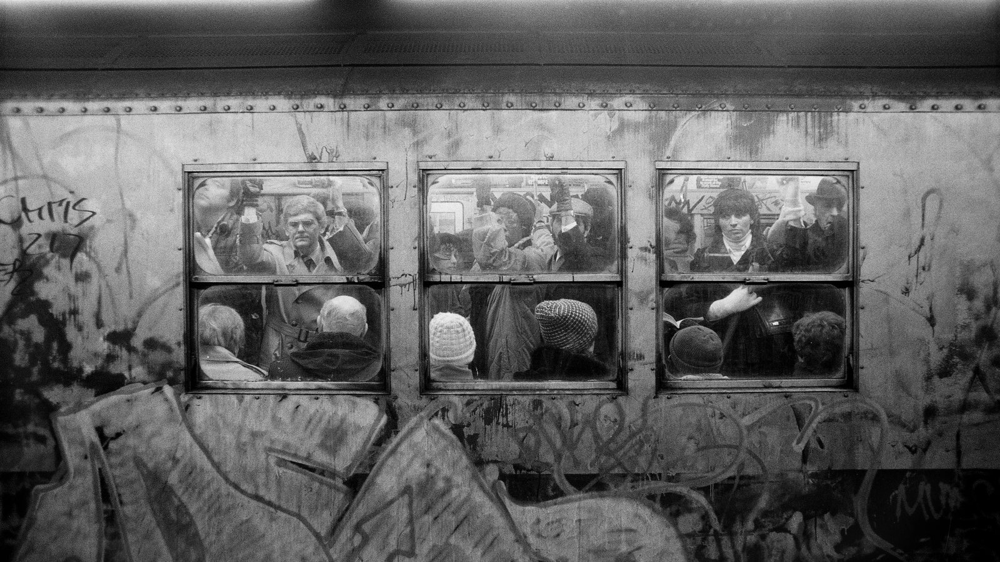
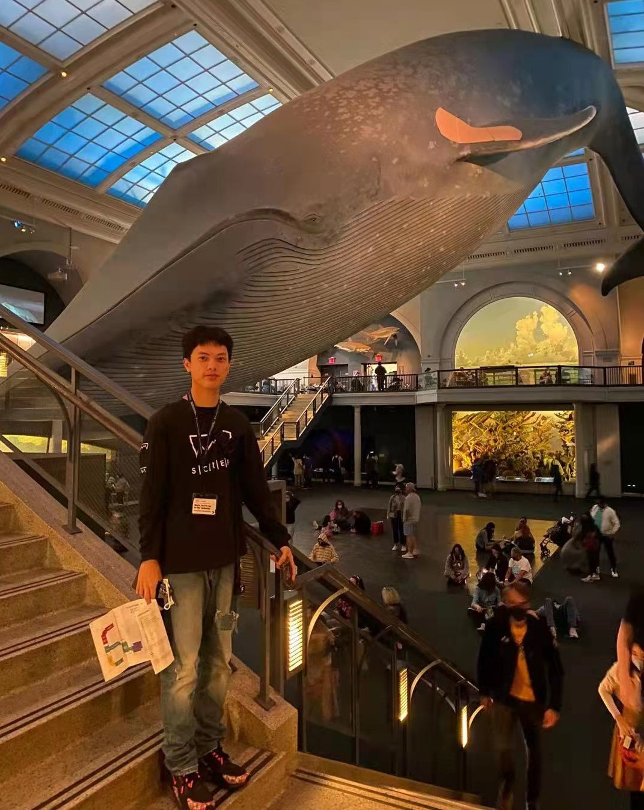

<link rel="stylesheet" href="academicons.css"/>
<link rel="stylesheet" href="styles.css" type="text/css">

#### Zheyan Liu, Chaoqi Wu, Baode Gao, Youyuan Kong, Zexu Yuan
#### Columbia University, Mailman School of Public Health
 

## Motivation 

New York subway, one of the main public transportations for New Yorkers, provides super convenience for local citizens, at the same time, brings potential danger to passengers, where criminals are attracted to busier subway stations for certain kinds of crime like pick pocketing, grand larceny and assault. The cloest train compartment can trigger cime and make victims harder to run. 

 

{width=60%}

 
11/21/2021, around 12:00 AM, at 34th Street-Penn Station in Manhattan, Alkeem Loney, a 32-year-old male, was stabbed in the neck during an unprovoked attack and was pronounced dead later as NYPD stated. The deadly incident is the latest in a pate of violence underground that comes as the MTA tries to get commuters back on mass transit. The horrible crime event raised lots of public concern about the safety at subway stations, the safety tightly related to almost every citizen who are living, working and studying in New York City. 

As students who are living here in New York City, most of us will almost take subway to the campus in early morning and back to apartment in nights on weekdays, and hang out with friends on weekends. Keeping away from danger at subway stations is closely related to ourselves. We hope we are able to help citizens to find the comparatively safe and reliable routes when taking subways.

### In this website, you can find:
  * Exploratory Data Analysis of subway crime with time (year, month, hour)
  * Exploratory Data Analysis of subway crime with location (coordiante-based Kmeans cluster, subway line, station)
  * Analysis of passengers flow of subway (time and location)
  * An interactive Shiny Dashboard about subway crime, people can look up crime rate in each location, distribution of each crime type.
  * [GNN](https://en.wikipedia.org/wiki/Graph_neural_network) model for predicting existence and severity of subway crime
  * No-crime Navigation shiny app based on [Google Maps Api](https://developers.google.com/maps) (give subway route), GNN model (predict crime existence) and historical passenger data (give crowdness).

## Team members

**Zheyan Liu**

[MS in Biostatistics at Columbia University](http://www.mailman.columbia.edu/academic-departments/biostatistics)  

Email: [zheyan.liu@columbia.edu](mailto:zheyan.liu@columbia.edu)  

[Website](https://zheyanliu99.github.io/), [Linkedin](https://www.linkedin.com/in/zheyanliu999/), [Github](https://github.com/zheyanliu99?tab=repositories)

*Contributions*

* 1 Cleaned and imputed subway passenger data; Built project website and orgnized final report
* 2 Conduct EDA on subway passenger data&location; Feature engineering on coordinates with K-means
* 3 Built subway naviagtion app based on Google Maps Apis and adapted GNN into crime prediction on each route

 

**Chaoqi Wu**

[MS in Biostatistics at Columbia University](http://www.mailman.columbia.edu/academic-departments/biostatistics)  

Email: [zheyan.liu@columbia.edu](mailto:zheyan.liu@columbia.edu)  

Website, Linkedin, Github

*Contributions*

* 1 
* 2 
* 3 

**Baode Gao**

[MS in Biostatistics at Columbia University](http://www.mailman.columbia.edu/academic-departments/biostatistics)  

Email: [zheyan.liu@columbia.edu](mailto:zheyan.liu@columbia.edu)  

Website, Linkedin, Github

*Contributions*

* 1 Cleaned and imputed subway passenger data; Built project website and orgnized final report
* 2 Conduct EDA on subway passenger data&location; Feature engineering on coordinates with K-means
* 3 Built subway naviagtion app based on Google Maps Apis and adapted GNN into crime prediction on each route

 

**Youyuan Kong**

[MS in Biostatistics at Columbia University](http://www.mailman.columbia.edu/academic-departments/biostatistics)  

Email: [zheyan.liu@columbia.edu](mailto:zheyan.liu@columbia.edu)  

Website, Linkedin, Github

*Contributions*

* 1 Clean and imputed subway passenger data; Build project website and partcipate in writing report
* 2 Conduct EDA on subway passenger data&location; Feature engineering on coordinates with K-means
* 3 Build subway naviagtion app based on Google Maps Apis and adapted GNN into crime prediction on each route

 

**Zexu Yuan**

[MPH in Biostatistics at Columbia University](http://www.mailman.columbia.edu/academic-departments/biostatistics)  

Email: [zy2392@columbia.edu](mailto:zy2392@columbia.edu)  

Website, Linkedin, Github

*Contributions*

* 1 Cleaned and imputed subway passenger data; Built project website and orgnized final report
* 2 Conduct EDA on subway passenger data&location; Feature engineering on coordinates with K-means

