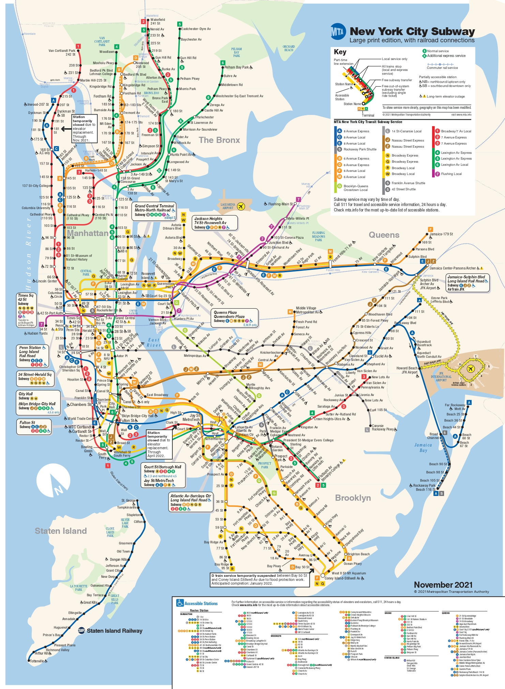

<link rel="stylesheet" href="academicons.css"/>
<link rel="stylesheet" href="styles.css" type="text/css">

```{r setup, include=FALSE}

knitr::opts_chunk$set(echo = TRUE)

library(tidyverse)
library(RColorBrewer)
library(data.table)
library(readxl)
library(rvest)
library(leaflet)
library(httr)
library(lubridate)
library(plotly)
library(tigris) 
##install.packages("leaflet.extras")
library(leaflet.extras)
set.seed(77)


knitr::opts_chunk$set(
  fig.width = 6,
  fig.asp = 1,
  out.width = "98%"
)

theme_set(theme_minimal() + theme(legend.position = 'bottom'))

options(
  ggplot2.continuous.colour = 'viridis',
  ggplot2.continuous.fill = 'viridis'
)

scale_colour_discrete = scale_colour_viridis_d
scale_fill_discrete = scale_fill_viridis_d


```
<center>

{width=60%}

</center>

# Introduction

New York subway, one of the main public transportations for New Yorkers, provides super convenience for local citizens, at the same time, brings potential danger to passengers, where criminals are attracted to busier subway stations for certain kinds of crime like pickpocketing, grand larceny, and assault. This closest place will trigger evil. 

On November 21, around 12:00 AM, at 34th Street-Penn Station in Manhattan, Alkeem Loney, a 32-year-old male, was stabbed in the neck during an unprovoked attack and was pronounced dead later as NYPD stated. The deadly incident is the latest in a pate of violence underground that comes as the MTA tries to get commuters back on mass transit. The horrible crime event raised lots of public concern about the safety at subway stations, the safety is tightly related to almost every citizen who is living, working, and studying in New York City. 

As students who are living here in New York City, most of us will almost take the subway to the campus in the early morning and back to the apartment in the night on weekdays, and hang out with friends on weekends. However, some of my friends experienced uncompleted crimes. Keeping away from danger at subway stations is closely related to ourselves. We hope we are able to help citizens to find comparatively safe and reliable routes when taking subways.

# Data


## Data Introduction

### Subway Crime

The orginal subway crime data has two parts.[The first one ](https://data.cityofnewyork.us/Public-Safety/NYPD-Complaint-Data-Current-Year-To-Date-/5uac-w243) contains all valid felony, misdemeanor, and violation crimes reported to the New York City Police Department--- [NYPD](https://www1.nyc.gov/site/nypd/index.page). The [second one](https://data.cityofnewyork.us/Public-Safety/NYPD-Complaint-Data-Historic/qgea-i56i)  includes similar crimes. We join these two data frames and only analyze crimes which happen in subway, NYC.  

The variables we use are(some useless variable's meaning can be found in the link above):

``` {r, include=FALSE}
variable_crime<-read_excel("data/variable explaination.xls")
```

`r variable_crime %>% knitr::kable()`

### Subway Passenger

The orginal [Subway passenger data](http://web.mta.info/developers/turnstile.html) is from [MTA](https://new.mta.info/)(Metropolitan Transportation Authority). The orginal data contains total entries and exits in each station in every 4 hours from 2010 to now. Data is not in a readable format, they are seperated by time in different htmls, we read and process passenger data with [ GenerateSubwayPassengerData.rmd](https://github.com/zheyanliu99/SubwayCrime/blob/main/data/GenerateSubwayPassengerData2.Rmd)

The variables we use are:

* STATION: Station name 
* LINENAME: Lines in this station, there can be more than one lines in one station
* DATE: Format MM/DD/YYYY
* TIME: Format 00:00:00
* ENTRIES:Cumulative entries
* EXITS: Cumulative exits 

| variablename | type      | range | note                                                                   |   |
|--------------|-----------|-------|------------------------------------------------------------------------|---|
| STATION      | Character |       | station name                                                           |   |
| LINENAME     | Character |       | lines in this station, there can be more than one lines in one station |   |
| DATE         | Date      |  Year>2010     | format MM/DD/YYYY                                                      |   |
| TIME         | Date      |       | format 00:00:00                                                        |   |
| ENTRIES      | Interger  |  >0    | cumulative entries                                                     |   |
| EXITS        | Interger  |  >0     | cumulative exits                                                       |   |


## Data Cleanning

### Subway Crime

#### the Least Distance
In order to compare crime and subway passengers' data, we find that we need to transfer to the same subway line and station name.(Different stations have different abbreviation.)</br>
We use the crime data's latitude and longitude to match the subway's data. The station in the subway information closet to the each row of crime data will be matched. (which has information about all the station's name, line and location.) </br>
Some crime data who have deviant longitude and latitude will be excluded. 

### Subway Passenger

#### K-Means

We set the number of clusters to be 8 and use Kmeans to cluster latitudes and longitudes. The color of each circle is the Kmeans cluster they belong and the size is the total number of passengers in 2021.

#### Imputation

Some missing data from passenger's exit and enter count, we use former average number to impute them. 

#### Google Map Api to find station coordinates

We want to get coordinates of each station for the following reasons

* location-based data visualization and analysis
* More location-based features for the model
* The station name in crime and passenger data are not matched, we can use corrdinates to match them

However, how to get the correct coordinates is tricky, there are open datas about NYC subway stations infomation and all of them have different naming system with ours. In addition, the station names contain lots of dupilicates. For instance, there are 2 86 st stations in middle Manhattan and another one in Brooklyn. We can get the correct coordinates of stations by using both station names and line names. Therefore, our solution is to use [Google Maps Api](https://developers.google.com/maps). The code we use is [Subway_info.py](https://github.com/zheyanliu99/SubwayCrime/blob/main/data/Subway_info.py)

#### Add service column

There are too many subway lines and some of them share most of the rails, therefore it is not reasonable to conduct analysis or building models with the line name. Therefore, we created a new variable called service based on the defination of MTA. For instance, line A, B and C are called 
'8 Avenue'.
<br>
<center>

{width=60%}

</center>
<br>


#### Chaoqi:correct subway line?
According to the New York City Subway instruction, there are several different transfer between lines. The first is the inside transfer, where you can transfer from one line to other line inside the station. For example, 14 St-Union Sq is a  station of Line LNQRW456. We don't need to some adjustment for these stations. 
The second one is free subway transfer and free out-of-way-system. This transfer is different from the inside transfer, passengers need to move from one station to other station for transfer. The data of these transfers has some problems. For example, there are free subway transfer between Court ST-23 ST(EM) and Court Sq(G7). However, the dataset shows the station and line is Court ST-23 ST:EGM, Court Sq:EGM, Court Sq:7. To deal with problem like this, we reassigned the line of station with free subway transfer or free out-of-way-system according to the New York City Subway instruction. In this case, we only consider the insider transfer station.


#### Outliers of entries and exits

For each station and given time, We got the actual entries and exits by calculating the difference of cumulative entries and exits between current time and last time. However, final results contains some outliers, some entries and exits are negative or extremely large. For these outliers, we replaced them with the mean of last two observations at the same time and station. We did this by  [FutherCleanPassenger.py](https://github.com/zheyanliu99/SubwayCrime/blob/main/data/FutherCleanPassenger.py).


# Exploratory Data Analysis

## Subway Crime

### Crime by Location

```{r read,include=FALSE}

crime_df = read_csv('data/subwaycrime_with_station_new.csv')

crime_df<-crime_df %>% 
 mutate(cmplnt_to_dt=as.Date(cmplnt_to_dt,format='%m/%d/%Y')) %>% 
 filter(distance<=0.0001)%>% 
 filter(cmplnt_to_dt>='2006-1-1')

```


### Where is crime?

New York City can be a dangerous place and crime from above ground will 
often extend into the NYC Subway.</br>
We mainly focus on the recent crime data on subway in NYC in this year, and 
there are `r nrow(crime_df)` complaints from 2006 to now. 

### Heat Map of Subway Crime in NYC, 2006-2021

From this map, you can check where the crime happened frequently. 
```{r heatmap, echo = FALSE, message=FALSE, warning=FALSE}
crime_df %>% 
  group_by(closest_station) %>% 
  summarise(Trend=n(),
            longitude=mean(longitude),
            latitude=mean(latitude)) %>% 
  leaflet() %>% 
  addTiles() %>% 
  addHeatmap(lng=~longitude,lat=~latitude,
             intensity=~exp(Trend),max=100,radius=5,blur=10)

```

### Map of Subway Crime in NYC, 2006-2021

From this map, you can check each crime's location, type, victim and suspects' 
information and time. 

```{r leaflet, echo = FALSE, message=FALSE, warning=FALSE}


leaflet(crime_df) %>%
  addProviderTiles(providers$CartoDB.Positron) %>% 
  addMarkers(lat = ~latitude, lng = ~longitude, 
             popup = paste("Offense Description:", crime_df$ofns_desc, "<br>",
                           "Suspect's age:",crime_df$susp_age_group,"<br>",
                           "Suspect's race:", crime_df$susp_race,"<br>",
                           "Suspect's gender:",crime_df$susp_sex,"<br>",
                           "Victim's age:",crime_df$vic_age_group,"<br>",
                           "Victim's race:", crime_df$vic_race,"<br>",
                           "Victim's gender:",crime_df$vic_sex,"<br>",
                           "Time:",crime_df$cmplnt_to_dt),
                clusterOptions = markerClusterOptions())
  


## "Offense Description:", crime_df$ofns_desc, "<br>",
## "<br>", 
##                 
##                 "Suspect Information", c(crime_df$susp_age_group,
##                                          crime_df$susp_race,
##                                          crime_df$susp_sex), "<br>",
##                 "Victim Information:", c(crime_df$vic_age_group,
##                                          crime_df$vic_race,
##                                          crime_df$vic_sex), 
```

### Distribution of crime in 7 Clusters

When firstly scanning the map above, you can ambiguously know how many crimes 
in each part of NYC, so let us check them in each ambiguously using bar chart.

```{r barcluster, echo = FALSE, message=FALSE, warning=FALSE}

crime_df %>% 
  count(cluster) %>% 
  mutate(cluster = fct_reorder(cluster, n)) %>% 
  slice_max(n,n=20) %>% 
  plot_ly(x = ~cluster, y = ~n, color = ~cluster, type = "bar", colors = "viridis") %>% 
  layout(yaxis = list(title = 'Number of Compliants'),
         xaxis = list(title = 'Cluster'))
```

### Top 10 offense classification


There are `r count(distinct(crime_df,ofns_desc))` kinds of crime occurring in the subway, there is the bar chart shows the wildest 10 crimes in the subway.

The most frequent crime mainly consists of grand larceny and assaults.

```{r offense, echo = FALSE, message=FALSE, warning=FALSE}

crime_df %>% 
  count(ofns_desc) %>% 
  mutate(ofns_desc = fct_reorder(ofns_desc, n)) %>% 
  slice_max(n,n=10) %>% 
  plot_ly(x = ~ofns_desc, y = ~n, color = ~ofns_desc, type = "bar", colors = "viridis") %>% 
  layout(yaxis = list(title = 'Number of Compliants'),
         xaxis = list(title = 'Type of Offense'))

### some data's resources
### https://stackoverflow.com/questions/51955803/how-to-change-x-axis-layout-using-plotly-in-r

```

### Top 20 station where crime happens frequently

From this chart, you can mainly check which station is the most dangerous station.
```{r station, echo = FALSE, message=FALSE, warning=FALSE}

crime_df %>% 
  count(closest_station) %>% 
  mutate(closest_station = fct_reorder(closest_station, n)) %>% 
  slice_max(n,n=20) %>% 
  plot_ly(x = ~closest_station, y = ~n, color = ~closest_station, type = "bar", colors = "viridis") %>% 
  layout(yaxis = list(title = 'Number of Compliants'),
         xaxis = list(title = 'Type of station'))


```


```{r suprace, echo = FALSE, message=FALSE, warning=FALSE}
## 
## crime_df %>% 
##   drop_na(cluster,susp_race) %>% 
##   filter(susp_race!="UNKNOWN") %>% 
##   count(cluster,susp_race) %>% 
##   mutate(cluster = fct_reorder(cluster, n)) %>% 
##   plot_ly(x = ~cluster, y = ~n, color = ~susp_race, type = "bar", colors = "viridis") %>% 
##   layout(
##          yaxis = list(title = 'Number of Compliants'),
##          xaxis = list(title = 'Area'))

```

### Barchart by each Borough about Victims

From this graph, you can check in each borough, which races more possibly 
vulnerable in the subway. 

As you can see, the proportion of African Americans in each cluster are stable; In Manhattan, where has the most crimes, white people(including white hispanic) are more vunlerable than African Americans in these places. 
```{r vicrace, echo = FALSE, message=FALSE, warning=FALSE}
crime_df %>%
  filter(vic_race!="UNKNOWN") %>%
  count(cluster,vic_race) %>%
  mutate(cluster = fct_reorder(cluster, n)) %>% 
  plot_ly(x = ~cluster, y = ~n, color = ~vic_race, type = "bar", colors = "viridis") %>%
  layout(
         yaxis = list(title = 'Number of Compliants'),
         xaxis = list(title = 'Cluster'))

```


### Gender Distrubution for popular crime types

In this part, we want to know which gender are more possible to become potential victims. We choose several types of crime from the most frequent kinds of crimes:</br>
ASSAULT 3 & RELATED OFFENSES,HARRASSMENT 2,GRAND LARCENY,FELONY ASSAULT,
ROBBERY,PETIT LARCENY,SEX CRIMES.</br>
We can find that crimes about sex crimes and harassment, female are more possible to be attacked. Crimes about regular theft, such as assault and larceny, male are potential victims comparing with female. 

```{r gender, echo = FALSE, message=FALSE, warning=FALSE}
crime_df %>% 
  filter(ofns_desc %in% c("ASSAULT 3 & RELATED OFFENSES",
                          "HARRASSMENT 2","GRAND LARCENY",
                          "FELONY ASSAULT",
                          "ROBBERY","PETIT LARCENY",
                          "SEX CRIMES")
  ) %>% 
  filter(vic_sex %in% c("F","M")) %>% 
  count(ofns_desc,vic_sex) %>% 
  mutate(ofns_desc = fct_reorder(ofns_desc, n)) %>% 
  plot_ly(x = ~ofns_desc, y = ~n, color = ~vic_sex, type = "bar", colors = "viridis") %>% 
  layout(
         yaxis = list(title = 'Number of Compliants'),
         xaxis = list(title = 'Age Group'))
  
                

```


### Female Age Distribution for Sex Crimes 

Let us talk more about age group for some specific crimes: SEX CRIMES and HARRASSMENT 2. </br>
Most of the victims' age are in the age 25-44 interval. 


```{r harrass, echo = FALSE, message=FALSE, warning=FALSE}
crime_df %>% 
  filter(ofns_desc %in% c("SEX CRIMES","HARRASSMENT 2")) %>% 
  count(vic_age_group,vic_race) %>% 
  filter(vic_age_group!="-59") %>% 
  filter(vic_age_group!="UNKNOWN") %>%
  filter(vic_race!="UNKNOWN") %>%
  plot_ly(x = ~vic_age_group, y = ~n, color = ~vic_race, type = "bar", colors = "viridis") %>% 
  layout(
         yaxis = list(title = 'Number of Compliants'),
         xaxis = list(title = 'Age Group-Female'))
  
```

### Crimr Rate Top 20
Sometimes, we more care about the crime rates on subway rather than number of crimes, because we also care the possiblity that the people standing in front of us is suspective. 
```{r crime_rate, echo = FALSE, message=FALSE, warning=FALSE}
crime_rate_summary<-read.csv("data/crime_rate_station.csv")
crime_rate_summary %>% 
  mutate(crime=n) %>% 
  select(-n) %>% 
  relocate(linename,station,flow,crime) %>% 
  slice_max(crime_rate,n=20) %>%
  knitr::kable()
  
```


### Crime by Time


## Subway Passenger


```{r read and process data, include=FALSE ,message=FALSE, warning=FALSE}
passenger_df = read_csv('data/passenger_imputed.csv', show_col_types = FALSE)

passenger_df = 
  passenger_df %>% 
  # Plotting use 1-year data 
  filter(date >= as.Date("2021-01-01"),
         date < as.Date("2021-11-05"))


# just use part of features
location_df = 
  read_csv('data/subway_info_final3.csv', show_col_types = FALSE) %>% 
  # only keep new york
  filter(administrative_area_level_1 == 'New York') %>% 
  select(station, linename, service, sublocality, postal_code, lat, long)
  

passenger_df = 
  passenger_df %>% 
  left_join(location_df, by = c('station', 'linename')) %>% 
  drop_na(sublocality) %>% 
  relocate(station, linename, service, sublocality, postal_code, lat, long)

```


### Subway passenger EDA with location


Passenger flow is closely related with crime. The more passenger flow in a station, the more criminals there will be. Therefore, we conduct EDA to:

* Find relationship between location and passenger flow
* Determine the most appropriate location variable for the model

#### Total passengers in each station

The color of each circle is the line of the subway and the size is the total number of passengers in 2021.

```{r, message=FALSE, warning=FALSE}
df = 
  passenger_df %>% 
    drop_na(entry_diff_imputed, exit_diff_imputed) %>% 
    group_by(station, service, linename, sublocality, postal_code, lat, long) %>% 
    summarise(total_entry = sum(entry_diff_imputed),
              total_exit = sum(exit_diff_imputed)) %>% 
    mutate(passenger_flow = total_entry + total_exit,
           # set passenger_flow to int
           passenger_flow = as.integer(passenger_flow))

# df %>% 
#   leaflet() %>% 
#   addTiles() %>% 
#   addCircleMarkers(~long, ~lat,radius= df$passenger_flow/100000000, weight= 0.9)


qpal <- colorQuantile("YlOrRd", df$passenger_flow, n = 4)

pal <- 
   colorFactor(palette = c("blue", "azure4", "orange",'green','green','brown','yellow','red','forestgreen','purple'), 
               levels = c('8 Avenue(ACE)',
                          'Shuttle(S)',
                          '6 Avenue(BDFM)',
                          'Brooklyn-Queens Crosstown(G)',
                          'Brooklyn-Queens(G)',
                          '14 St-Canarsie(L)',
                          'Broadway(NQRW)',
                          '7 Avenue(123)',
                          'Lexington Av(456)',
                          'Flushing(7)'))


df %>% 
  mutate(service = ifelse(service == 'Brooklyn-Queens Crosstown(G)', 'Brooklyn-Queens(G)', service)) %>% 
  mutate(passenger_flow2 = 10*log(passenger_flow)) %>% 
  leaflet() %>% 
  addProviderTiles(providers$CartoDB.Positron) %>% 
  addCircles(lng = ~long, lat = ~lat, weight = 1, stroke = FALSE,
    radius = ~sqrt(passenger_flow)/20, popup = ~station, color = ~pal(service), opacity = 0.75, fillOpacity = 0.75) %>%
  addLegend("topright", pal = pal, values = ~service, 
            title = "Subway Service", opacity = 0.75) %>% 
  setView(-73.8399986, 40.746739, zoom = 11)
```

There are patterns between station locations and total passenger flow. Big stations are mostly located in lower and middle Manhattan, and there are some sub center stations in other areas, such as *9th Street* station in Brooklyn and *FLUSHING-MAIN* station in Queen.

#### By sublocality

```{r}
df %>% 
  ungroup %>% 
  filter('sublocality' != 'None') %>% 
  drop_na() %>% 
  group_by(sublocality) %>%  
  summarise(passenger_flow = sum(passenger_flow)) %>% 
  mutate(sublocality = as.factor(sublocality)) %>% 
  arrange(-passenger_flow) %>% 
  filter(passenger_flow < 500000 |passenger_flow > 60000000) %>% 
  knitr::kable()

```

Manhattan has the most subway passengers in 2021 and Staten Island has the least subway passenger_flow. Additionally, sublocality only has 5 levels, which is too few for a machine learning model.

#### EDA with zipcode

##### Total passengers in each zipcode


```{r, message=FALSE, warning=FALSE}
# cache zip boundaries that are download via tigris package
options(tigris_use_cache = TRUE)


# get zip boundaries that start with 282
char_zips = zctas(cb = TRUE)
char_zips = 
  char_zips %>% 
  rename(postal_code = GEOID10)

summary_df<-
  df %>%
  mutate(postal_code) %>% 
  group_by(postal_code) %>%
  summarise(passenger_flow = sum(passenger_flow),
            station_cnt = n_distinct(station, linename)) 


summary_df<-geo_join(char_zips, 
                      summary_df, 
                      by_sp = "postal_code", 
                      by_df = "postal_code",
                      how = "left") %>% 
  filter(passenger_flow>=0)

pal <- colorNumeric(
  palette = "Greens",
  domain = summary_df$passenger_flow,
  na.color = "white")

labels <- 
  paste0(
    "Zip Code: ",
    summary_df$postal_code, "<br/>",
    "Flow of Passengers: ",
    summary_df$passenger_flow) %>%
  lapply(htmltools::HTML)

# summary_df2 = 
#   char_zips %>% 
#     select(postal_code) %>% 
#     left_join(summary_df, by = 'postal_code') 

summary_df %>%  
  mutate(postal_code_int = as.integer(postal_code)) %>% 
  filter(postal_code_int >= 10000 & postal_code_int < 14900) %>% 
  leaflet() %>%
  addProviderTiles(providers$CartoDB.Positron) %>% 
   addPolygons(fillColor = ~pal(passenger_flow),
              weight = 2,
              opacity = 1,
              color = "white",
              dashArray = "3",
              fillOpacity = 0.7,
              highlight = highlightOptions(weight = 2,
                                           color = "#666",
                                           dashArray = "",
                                           fillOpacity = 0.7,
                                           bringToFront = TRUE),
              label = labels) %>% 
  addLegend(pal = pal, 
            values = ~passenger_flow, 
            opacity = 0.7, 
            title = htmltools::HTML("Total Passengers 2021"),
            position = "bottomright") %>% 
  setView(-73.8399986, 40.746739, zoom = 10)


```


##### Total subway stations in each zipcode

```{r, warning=FALSE}
labels <- 
  paste0(
    "Zip Code: ",
    summary_df$postal_code, "<br/>",
    "Stations count: ",
    summary_df$station_cnt) %>%
  lapply(htmltools::HTML)


pal <- colorNumeric(
  palette = "Purples",
  domain = summary_df$station_cnt,
  na.color = "white")

summary_df %>%  
  mutate(postal_code_int = as.integer(postal_code)) %>% 
  filter(postal_code_int >= 10000 & postal_code_int < 14900) %>% 
  leaflet() %>%
  addProviderTiles(providers$CartoDB.Positron) %>% 
   addPolygons(fillColor = ~pal(station_cnt),
              weight = 2,
              opacity = 1,
              color = "white",
              dashArray = "3",
              fillOpacity = 0.7,
              highlight = highlightOptions(weight = 2,
                                           color = "#666",
                                           dashArray = "",
                                           fillOpacity = 0.7,
                                           bringToFront = TRUE),
              label = labels) %>% 
  addLegend(pal = pal, 
            values = ~station_cnt, 
            opacity = 0.7, 
            title = htmltools::HTML("Total Stations 2021"),
            position = "bottomright") %>% 
  setView(-73.8399986, 40.746739, zoom = 10)
```

The zipcode does not demonstrate the exact relationship between location and passenger flow. For instance, some zipcodes such as *10002* and *10011* in lower Manhattan should have more passengers, however few stations are built there. Therefore, the key cause to this confusion is that subway stations are not built based on zipcode.

#### Kmeans analysis of station

We set the number of clusters to be 8 and use Kmeans to cluster latitudes and longitudes. The color of each circle is the Kmeans cluster they belong and the size is the total number of passengers in 2021.

```{r, message=FALSE, warning=FALSE}

# conduct kmeans
df_sub = 
  df %>% 
  ungroup() %>% 
  select(long, lat) %>% 
  drop_na()

k2 = kmeans(df_sub, centers = 8, nstart = 25)

# EDA with Kmeans results
df$cluster = k2$cluster

df = 
  df %>%
  mutate(cluster = case_when(
    cluster == 1 ~ 'Queen',
    cluster == 2 ~ 'Upper Manhattan',
    cluster == 3 ~ 'Queen-Brooklyn',
    cluster == 4 ~ 'Middle Manhattan',
    cluster == 5 ~ 'Bronx',
    cluster == 6 ~ 'Brooklyn',
    cluster == 7 ~ 'Lower Manhattan',
    cluster == 8 ~ 'Rockaway Beach',
  ))

pal = colorFactor(
  brewer.pal(n = 10, name = "Set1"),
  df$cluster,
  levels = NULL,
  ordered = FALSE,
  na.color = "#808080",
  alpha = FALSE,
  reverse = FALSE
)

df %>% 
  leaflet() %>% 
  addProviderTiles(providers$CartoDB.Positron) %>% 
  addCircles(lng = ~long, lat = ~lat, weight = 1, stroke = FALSE,
    radius = ~sqrt(passenger_flow)/20, popup = ~station, color = ~pal(cluster), opacity = 1, fillOpacity = 1) %>%
  addLegend("topright", pal = pal, values = ~cluster, 
            title = "Kmeans Cluster", opacity = 1) %>% 
  setView(-73.8399986, 40.746739, zoom = 11)


```


Kmeans algorithm cluster Manhattan into three parts: lower Manhattan, middle Manhattan and upper Manhattan. Brooklyn and Queens shares 3 cluster. Also, there is a cluster for Bronx. We think the Kmeans result is easier to interpret than that of zipcode or sublocality and it can partly represent the relationship between passenger flow and location. Therefore, we use Kmeans result as the location variable in our model.


# Model

## Introduction


## Methodology

## Reult


# Model Application

1.Google Api
2.How to use

# Summary

1.Discussion
2.Results
3.Distribution
4.Limitations
5.Acknowledgement
6.Reference
7.Appendix
